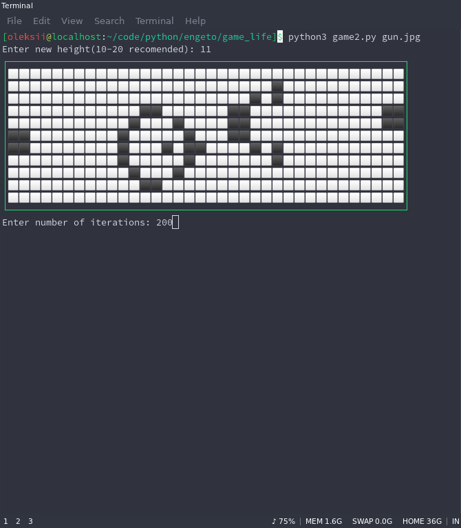

Game of life in the terminal.
-----------------------------

In the beginning you need to chose number of iterations and size of the field
that depends from configuration of your terminal.
1. You can run script as it is and choose one of the generated figures:
	* random
	* boat
	* beacon 
2. You can add image file as argument for script and see 'life of your image.
Script will ask you about height of the picture for generating correct 'universe'

Example of running script with 'universe' based on [image](https://en.wikipedia.org/wiki/Gun_(cellular_automaton)#/media/File:Game_of_life_glider_gun.svg):

